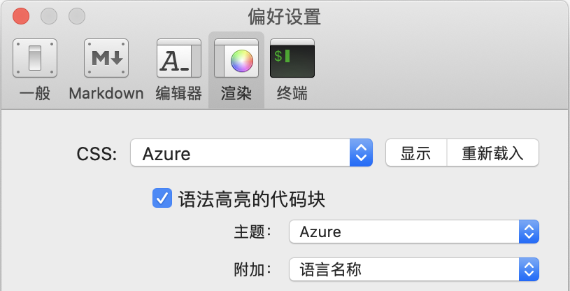

## 简介 ##
MacDown是一款很酷的MarkDown编辑器，它的`Fenced code block`很适合写技术文章，但是自带的渲染样式对中文字体支持的不够好，所以我在GitHub2样式的基础上改造了一款`Azure`样式。  

## 适用平台 ##
理论上适用于所有的MacDown版本，但我只在下列环境中验证过。
> MacOS Catalina 10.15.4  
> MacDown 0.7.3  

## 安装步骤 ##

首先从github上拉取样式文件到MacDown目录  

```bash
wget https://raw.github.com/kdbg/macdown-styles/master/Resources/Styles/Azure.css -O /Applications/MacDown.app/Contents/Resources/Styles/Azure.css
wget https://raw.github.com/kdbg/macdown-styles/master/Resources/Styles/Azure2.css -O /Applications/MacDown.app/Contents/Resources/Styles/Azure2.css
wget https://raw.github.com/kdbg/macdown-styles/master/Resources/Prism/components.js -O /Applications/MacDown.app/Contents/Resources/Prism/components.js
wget https://raw.github.com/kdbg/macdown-styles/master/Resources/Prism/themes/prism-azure.css -O /Applications/MacDown.app/Contents/Resources/Prism/themes/prism-azure.css
```
然后重启MacDown并启用`Azure`样式  


## 效果展示 ##


